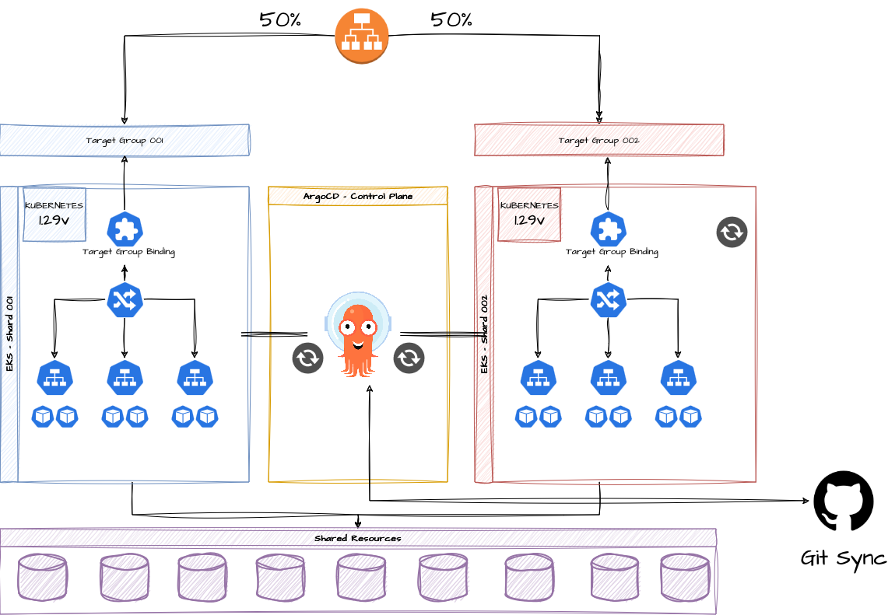
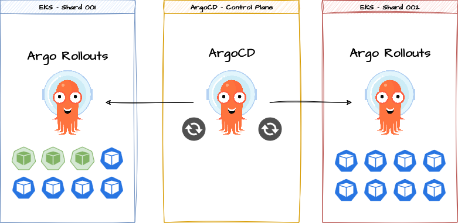

# Proof of Concept - Using ArgoCD and Argo Rollouts to Manage Sharding Replication Between EKS Clusters

## Proof of Concept Goals

The objective of this proof of concept is to replicate the same deployments and resources in a cell-based or sharding-based across multiple AWS EKS (Elastic Kubernetes Service) clusters.

### Infraestructure Update With Zero Downtime 

All clusters will share the same load balancers, and traffic distribution will be carried out based on the weight of the Target Group.


It will be necessary to have the capability to remove any cluster immediately to perform version updates, golden image updates, scheduled maintenance, and operational routines without impacting the customers. Achieving partial infrastructure maintenance with zero downtime.


The test should provide the ability to update various shards on different days/weeks/months. 

Cluster and infrastructure updates should be done partially, where all Kubernetes shards will be separated into different repositories, where they will be updated and versioned separately.





### Blue/Green - Canary Releases By Shard

Application deployments must support canary and blue/green deployments, both clusters independently. The rollouts must be carried out in a controlled and monitored way in each of the clusters. In the case of a canary rollout, it should start with `weight 0` and require manual intervention to proceed to the next steps.

```yaml
apiVersion: argoproj.io/v1alpha1
kind: Rollout
metadata:
  name: nginx-deployment
spec:
  replicas: 10
# ...
  strategy:
    canary:
      steps:
      - setWeight: 0 # <----
      - pause: {}
      - setWeight: 50
      - pause: {}
      - setWeight: 100
```




### Easy Way to Ingress/Egress new Shards 

If there's a need to incorporate new cluster shards into the workload, it must be created, plugged into automation, and automatically the entire workload should be synced via Argo without the need for specific deployments.

## Setup 

### VPC - Networking Shared Resources 

```bash
cd vpc/
terraform init
terraform apply --auto-approve
```

### Application Load Balancers - Shared Ingress

```bash
cd ingress/
terraform init
terraform apply --auto-approve
```

### Setup EKS Application Shards 

```bash
cd shard-1/
terraform init
terraform apply --auto-approve

cd ..

cd shard-2/
terraform init
terraform apply --auto-approve
```

### Setup ArgoCD Cluster

```bash
cd argo-cluster/
terraform init
terraform apply --auto-approve
```

#### Get ArgoCD Admin

```
kubectl get secret argocd-initial-admin-secret -o jsonpath="{.data.password}" | base64 -d
```

## Contents / Tooling

| Necessity                            | Tooling                                                            |
|--------------------------------------|-------------------------------------------------------------------|
| Infrastructure as Code               | Terraform                                                         |
| Demo Workload                        | [Nutrition Overengineering](https://github.com/msfidelis/nutrition-overengineering) |
| Kubernetes Ingress and Traffic       | Istio                                                             |
| Continuous Delivery / State Enforcement | ArgoCD                                                           |
| Blue/Green - Canary Releases | ArgoRollouts                                                         |